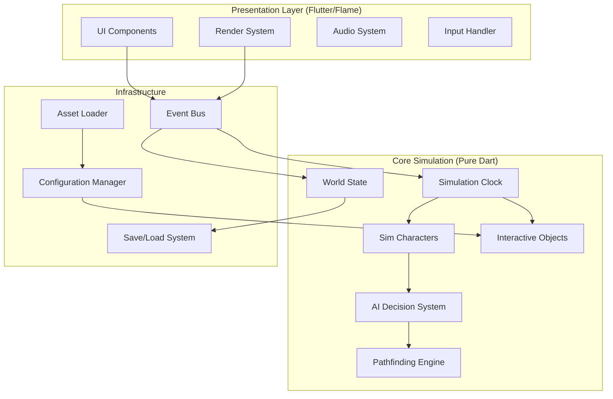

# Design Document

## Overview

This design document outlines the architecture for a Sims 1-inspired life simulation game built with Dart and Flutter. The system follows a strict separation between the core simulation engine (pure Dart) and the presentation layer (Flutter/Flame), enabling deterministic gameplay, comprehensive testing, and cross-platform deployment.

The architecture implements a need-based AI system where autonomous characters (Sims) make decisions through an advertisement-scoring mechanism, all running on a fixed-timestep simulation clock for deterministic behavior.

## Architecture

### High-Level Architecture Diagram



### Layer Separation

**Core Simulation Layer (Pure Dart)**
- Contains all game logic and state
- No dependencies on Flutter or Flame
- Fully deterministic and testable
- Communicates via events only

**Presentation Layer (Flutter/Flame)**
- Handles rendering, UI, and audio
- Subscribes to simulation events
- Sends input commands via event bus
- Interpolates between simulation ticks for smooth visuals

**Infrastructure Layer**
- Provides cross-cutting concerns
- Event bus for decoupled communication
- Serialization for save/load functionality
- Asset loading and configuration management

## Components and Interfaces

### Core Simulation Components

#### SimulationClock
```dart
abstract class SimulationClock {
  static const int TICKS_PER_SECOND = 15;
  static const Duration TICK_DURATION = Duration(milliseconds: 67);
  
  void start();
  void pause();
  void step(); // Single tick for debugging
  Stream<TickEvent> get tickStream;
  int get currentTick;
}
```

#### World State
```dart
class World {
  final Grid grid;
  final List<Sim> sims;
  final List<InteractiveObject> objects;
  final Map<String, dynamic> globalState;
  
  void tick(int currentTick);
  void addSim(Sim sim);
  void addObject(InteractiveObject object);
  List<InteractiveObject> getObjectsInRange(Position pos, double range);
}
```

#### Sim Character
```dart
class Sim {
  final String id;
  final String name;
  final Position position;
  final NeedContainer needs;
  final TraitContainer traits;
  final ActionQueue actionQueue;
  final AIDecisionMaker ai;
  
  void tick(int currentTick, World world);
  void executeAction(Action action);
  double calculateScore(InteractiveObject object);
}
```

#### Need System
```dart
class Need {
  final String type;
  double value; // 0.0 to 100.0
  final double decayRate;
  
  void decay(double deltaTime);
  bool get isCritical => value < 20.0;
}

class NeedContainer {
  final Map<String, Need> needs;
  
  void tick(double deltaTime);
  Need getMostUrgent();
  double getDeficit(String needType);
}
```

#### Interactive Objects
```dart
abstract class InteractiveObject {
  final String id;
  final Position position;
  final Map<String, double> advertisements;
  final List<ComponentMixin> components;
  final List<RoutingSlot> routingSlots;
  
  InteractiveObject({
    required this.id,
    required this.position,
    required this.advertisements,
    required this.components,
    required this.routingSlots,
  }) {
    _validateComponentDependencies();
  }
  
  void _validateComponentDependencies() {
    Set<Type> requiredTypes = <Type>{};
    Set<Type> providedTypes = components.map((c) => c.runtimeType).toSet();
    
    for (ComponentMixin component in components) {
      requiredTypes.addAll(component.dependencies);
    }
    
    Set<Type> missing = requiredTypes.difference(providedTypes);
    if (missing.isNotEmpty) {
      throw ComponentDependencyException('Missing components: $missing');
    }
  }
  
  bool canInteract(Sim sim);
  List<Action> getAvailableActions(Sim sim);
  void onInteraction(Sim sim, Action action);
}

class RoutingSlot {
  final Vector2 localOffset;
  final Direction facing;
  final String id;
  
  const RoutingSlot({
    required this.localOffset,
    required this.facing,
    required this.id,
  });
  
  Position getWorldPosition(Position objectPosition) {
    return objectPosition + localOffset;
  }
}

abstract class ComponentMixin {
  Set<Type> get dependencies => <Type>{};
}

mixin Sittable on InteractiveObject implements ComponentMixin {
  bool get isOccupied;
  void sit(Sim sim);
  void stand(Sim sim);
  
  @override
  Set<Type> get dependencies => <Type>{};
}

mixin Flammable on InteractiveObject implements ComponentMixin {
  double get fireResistance;
  void ignite();
  void extinguish();
  
  @override
  Set<Type> get dependencies => <Type>{};
}
```

### AI Decision System

#### Advertisement-Scoring Algorithm
```dart
class AIDecisionMaker {
  static const int EVALUATION_INTERVAL = 4; // ticks
  
  double calculateObjectScore(Sim sim, InteractiveObject object) {
    double score = 0.0;
    
    // Need satisfaction scoring
    for (String needType in object.advertisements.keys) {
      double needDeficit = sim.needs.getDeficit(needType);
      double adValue = object.advertisements[needType]!;
      score += needDeficit * adValue;
    }
    
    // Distance penalty
    double distance = sim.position.distanceTo(object.position);
    score -= distance * DISTANCE_COST_FACTOR;
    
    // Trait modifiers
    score = sim.traits.modifyScore(score, object);
    
    return score;
  }
  
  Action? selectBestAction(Sim sim, World world) {
    if (sim.actionQueue.isNotEmpty) return null;
    
    List<InteractiveObject> candidates = world.getObjectsInRange(
      sim.position, MAX_INTERACTION_RANGE
    );
    
    InteractiveObject? bestObject;
    double bestScore = 0.0;
    
    for (InteractiveObject obj in candidates) {
      if (!obj.canInteract(sim)) continue;
      
      double score = calculateObjectScore(sim, obj);
      if (score > bestScore) {
        bestScore = score;
        bestObject = obj;
      }
    }
    
    return bestObject?.getAvailableActions(sim).first;
  }
}
```

### Pathfinding Engine

#### Grid-Based A* Implementation
```dart
class PathfindingEngine {
  final Grid grid;
  final AStarAlgorithm astar;
  
  Path? findPath(Position start, Position goal, Sim sim) {
    // Three-tier pathfinding:
    // 1. Room-level routing
    // 2. Area-level routing within rooms  
    // 3. Tile-level A* pathfinding
    
    List<Room> roomPath = findRoomPath(start, goal);
    if (roomPath.isEmpty) return null;
    
    List<Position> tilePath = [];
    for (int i = 0; i < roomPath.length - 1; i++) {
      List<Position> segment = findTilePathBetweenRooms(
        roomPath[i], roomPath[i + 1], sim
      );
      tilePath.addAll(segment);
    }
    
    return Path(tilePath);
  }
  
  void handleDynamicObstacle(Position pos, Sim movingSim) {
    // Implement soft collision avoidance
    // Use offset paths or wait-with-backoff strategy
  }
}
```

## Data Models

### Configuration Schema
```dart
@freezed
class ObjectDefinition with _$ObjectDefinition {
  const factory ObjectDefinition({
    required String id,
    required String name,
    required Map<String, double> advertisements,
    required List<String> components,
    required List<ActionDefinition> actions,
    @Default({}) Map<String, dynamic> properties,
  }) = _ObjectDefinition;
  
  factory ObjectDefinition.fromJson(Map<String, dynamic> json) =>
      _$ObjectDefinitionFromJson(json);
}

@freezed
class SimDefinition with _$SimDefinition {
  const factory SimDefinition({
    required String id,
    required String name,
    required Map<String, double> initialNeeds,
    required List<String> traits,
    @Default({}) Map<String, dynamic> properties,
  }) = _SimDefinition;
  
  factory SimDefinition.fromJson(Map<String, dynamic> json) =>
      _$SimDefinitionFromJson(json);
}
```

### Save Data Format
```dart
@freezed
class SaveData with _$SaveData {
  const factory SaveData({
    required int version,
    required int currentTick,
    required DateTime saveTime,
    required WorldState world,
    required List<SimState> sims,
    required Map<String, dynamic> globalState,
  }) = _SaveData;
  
  factory SaveData.fromJson(Map<String, dynamic> json) =>
      _$SaveDataFromJson(json);
}
```

## Error Handling

### Graceful Degradation Strategy
```dart
class SimulationErrorHandler {
  static void handleSimulationError(Object error, StackTrace stack) {
    // Log error with timestamp
    Logger.error('Simulation error at tick ${Clock.currentTick}', 
                 error: error, stackTrace: stack);
    
    // Attempt recovery without affecting presentation layer
    if (error is PathfindingException) {
      _resetSimToSafePosition(error.sim);
    } else if (error is AIDecisionException) {
      _resetSimAI(error.sim);
    }
    
    // Emit error event for UI notification
    EventBus.instance.emit(SimulationErrorEvent(error, stack));
  }
}

class RenderErrorHandler {
  static void handleAssetLoadError(String assetPath, Object error) {
    Logger.warning('Failed to load asset: $assetPath');
    AssetLoader.instance.useFallback(assetPath);
  }
  
  static void handleRenderError(Object error, StackTrace stack) {
    Logger.error('Render error', error: error, stackTrace: stack);
    // Render errors should never affect simulation state
    EventBus.instance.emit(RenderErrorEvent(error, stack));
  }
}
```

### Validation and Schema Checking
```dart
class ConfigValidator {
  static ValidationResult validateObjectDefinition(ObjectDefinition obj) {
    List<String> errors = [];
    
    if (obj.advertisements.isEmpty) {
      errors.add('Object must have at least one advertisement');
    }
    
    for (double value in obj.advertisements.values) {
      if (value < 0 || value > 100) {
        errors.add('Advertisement values must be between 0 and 100');
      }
    }
    
    return ValidationResult(errors.isEmpty, errors);
  }
}
```

## Testing Strategy

### Unit Testing Approach
```dart
// Core simulation components are pure Dart and fully testable
class SimulationTest {
  @test
  void testNeedDecay() {
    Need hunger = Need('hunger', value: 100.0, decayRate: 1.0);
    hunger.decay(10.0); // 10 seconds
    expect(hunger.value, equals(90.0));
  }
  
  @test
  void testAIDecisionMaking() {
    Sim sim = createTestSim(hungerLevel: 20.0);
    InteractiveObject fridge = createTestFridge();
    World world = createTestWorld([fridge]);
    
    Action? action = sim.ai.selectBestAction(sim, world);
    expect(action?.targetObject, equals(fridge));
  }
  
  @test
  void testDeterministicSimulation() {
    World world1 = createTestWorld();
    World world2 = createTestWorld();
    
    // Run same simulation steps
    for (int i = 0; i < 100; i++) {
      world1.tick(i);
      world2.tick(i);
    }
    
    expect(world1.toJson(), equals(world2.toJson()));
  }
}
```

### Integration Testing
```dart
class IntegrationTest {
  @test
  void testSaveLoadRoundtrip() {
    World originalWorld = createComplexTestWorld();
    
    // Save world state
    SaveData saveData = SaveSystem.createSaveData(originalWorld);
    String json = jsonEncode(saveData.toJson());
    
    // Load world state
    SaveData loadedData = SaveData.fromJson(jsonDecode(json));
    World loadedWorld = SaveSystem.restoreWorld(loadedData);
    
    expect(loadedWorld.toJson(), equals(originalWorld.toJson()));
  }
}
```

### Performance Testing
```dart
class PerformanceTest {
  @test
  void testSimulationPerformance() {
    World world = createWorldWithManySims(simCount: 50);
    
    Stopwatch stopwatch = Stopwatch()..start();
    
    // Run 100 simulation ticks
    for (int i = 0; i < 100; i++) {
      world.tick(i);
    }
    
    stopwatch.stop();
    
    // Should complete within performance budget
    expect(stopwatch.elapsedMilliseconds, lessThan(1000));
  }
}
```

## Performance Optimizations

### Isolate-Based Concurrency
```dart
class IsolateTask<T, R> {
  final SendPort _sendPort;
  final ReceivePort _receivePort = ReceivePort();
  
  IsolateTask(this._sendPort);
  
  Future<R> execute(T request) async {
    _sendPort.send({'request': request, 'replyTo': _receivePort.sendPort});
    return await _receivePort.first as R;
  }
}

class SimulationManager {
  late IsolateTask<AIRequest, AIResponse> _aiTask;
  late IsolateTask<PathRequest, PathResponse> _pathTask;
  
  void initializeIsolates() async {
    ReceivePort aiPort = ReceivePort();
    ReceivePort pathPort = ReceivePort();
    
    await Isolate.spawn(_aiWorker, aiPort.sendPort);
    await Isolate.spawn(_pathfindingWorker, pathPort.sendPort);
    
    _aiTask = IsolateTask<AIRequest, AIResponse>(aiPort.sendPort);
    _pathTask = IsolateTask<PathRequest, PathResponse>(pathPort.sendPort);
  }
  
  static void _aiWorker(SendPort sendPort) {
    // Heavy AI computations with typed messaging
  }
  
  static void _pathfindingWorker(SendPort sendPort) {
    // A* pathfinding with typed messaging
  }
}
```

### Object Pooling
```dart
class ObjectPool<T> {
  final Queue<T> _available = Queue<T>();
  final T Function() _factory;
  
  ObjectPool(this._factory);
  
  T acquire() {
    if (_available.isNotEmpty) {
      return _available.removeFirst();
    }
    return _factory();
  }
  
  void release(T object) {
    if (object is Poolable) {
      object.reset();
    }
    _available.add(object);
  }
}

// Usage for frequently created objects
final pathNodePool = ObjectPool<PathNode>(() => PathNode());
final actionPool = ObjectPool<Action>(() => Action());
```

### Sprite Batching for Isometric Rendering
```dart
class IsometricRenderer {
  final SpriteBatch _tileBatch = SpriteBatch();
  final SpriteBatch _objectBatch = SpriteBatch();
  
  void render(Canvas canvas, World world) {
    // Batch tiles by texture atlas
    _tileBatch.begin();
    for (Tile tile in world.grid.tiles) {
      _tileBatch.draw(tile.sprite, tile.isometricPosition);
    }
    _tileBatch.end(canvas);
    
    // Sort objects by Y-coordinate for proper depth
    List<InteractiveObject> sortedObjects = world.objects.toList()
      ..sort((a, b) => a.position.y.compareTo(b.position.y));
    
    _objectBatch.begin();
    for (InteractiveObject obj in sortedObjects) {
      _objectBatch.draw(obj.sprite, obj.isometricPosition);
    }
    _objectBatch.end(canvas);
  }
}
```

## Additional Systems

### Audio System
```dart
enum AudioGroup { ui, sfx, ambient }

class AudioManager {
  final Map<AudioGroup, double> _groupVolumes = {
    AudioGroup.ui: 1.0,
    AudioGroup.sfx: 1.0,
    AudioGroup.ambient: 0.7,
  };
  
  void playSound(String soundId, AudioGroup group) {
    double volume = _groupVolumes[group] ?? 1.0;
    // Play sound with group volume
    EventBus.instance.emit(PlaySoundEvent(soundId, group, volume));
  }
  
  void setGroupVolume(AudioGroup group, double volume) {
    _groupVolumes[group] = volume.clamp(0.0, 1.0);
  }
}
```

### Localization System
```dart
class LocalizationBundle {
  final Map<String, String> _strings = {};
  
  static LocalizationBundle? _instance;
  static LocalizationBundle get instance => _instance!;
  
  static Future<void> initialize(String languageCode) async {
    _instance = LocalizationBundle();
    await _instance!._loadLanguage(languageCode);
  }
  
  Future<void> _loadLanguage(String languageCode) async {
    String content = await rootBundle.loadString('assets/i18n/$languageCode.arb');
    Map<String, dynamic> data = jsonDecode(content);
    _strings.clear();
    data.forEach((key, value) => _strings[key] = value.toString());
  }
  
  String getString(String key, [Map<String, String>? params]) {
    String text = _strings[key] ?? key;
    if (params != null) {
      params.forEach((param, value) {
        text = text.replaceAll('{$param}', value);
      });
    }
    return text;
  }
}
```

### Autosave System
```dart
class AutosaveManager {
  static const Duration AUTOSAVE_INTERVAL = Duration(minutes: 10);
  static const int MAX_AUTOSAVE_SLOTS = 3;
  
  Timer? _autosaveTimer;
  int _currentSlot = 0;
  
  void startAutosave() {
    _autosaveTimer = Timer.periodic(AUTOSAVE_INTERVAL, (_) {
      _performAutosave();
    });
  }
  
  void _performAutosave() {
    String filename = 'autosave_$_currentSlot.json';
    SaveSystem.saveToFile(filename, World.current);
    _currentSlot = (_currentSlot + 1) % MAX_AUTOSAVE_SLOTS;
    
    EventBus.instance.emit(AutosaveCompleteEvent(filename));
  }
  
  void stopAutosave() {
    _autosaveTimer?.cancel();
    _autosaveTimer = null;
  }
}
```

### Asset Pipeline Tools
```dart
// Tool script: tool/build_atlas.dart
class AtlasBuilder {
  static Future<void> buildSpriteAtlas() async {
    Directory sourceDir = Directory('assets/images/sprites');
    List<File> imageFiles = sourceDir
        .listSync(recursive: true)
        .whereType<File>()
        .where((f) => f.path.endsWith('.png'))
        .toList();
    
    // Pack sprites into atlas
    AtlasData atlas = _packSprites(imageFiles);
    
    // Save atlas image and manifest
    await File('assets/images/atlas.png').writeAsBytes(atlas.imageData);
    await File('assets/data/atlas_manifest.json')
        .writeAsString(jsonEncode(atlas.manifest));
    
    print('Built atlas with ${atlas.manifest.length} sprites');
  }
  
  static AtlasData _packSprites(List<File> imageFiles) {
    // Implementation of sprite packing algorithm
    // Returns packed atlas image and sprite coordinate manifest
  }
}
```

## Configuration and Constraints

### World Limits
- **Lot Size**: 64 × 64 tiles maximum per lot
- **Maximum Concurrent Sims**: 30 characters for optimal performance
- **Pathfinding Budget**: 100ms maximum per pathfinding request
- **Simulation Target**: 15 Hz fixed timestep, 60 FPS rendering

### Performance Targets
- **Unit Test Coverage**: ≥80% for lib/core/** (simulation logic)
- **Memory Usage**: <500MB for typical gameplay session
- **Load Time**: <3 seconds for saved game loading
- **Frame Rate**: Maintain 30+ FPS on integrated GPU from 2018

This design provides a solid foundation for building a Sims-like game with Dart and Flutter, emphasizing modularity, testability, and performance while maintaining the core gameplay mechanics that made the original Sims engaging.